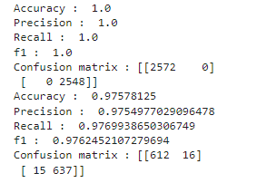
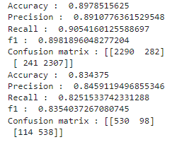
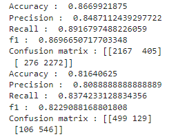

# Project 4 - UPenn Data Science Boot Camp

Group Members: Rajib Maji, Hannah Whang, Michael Cariello, Theresa Bravo, Arame Diasse, Nick O'karma, Stephen Smith.

## Alzheimer's Disease Detection and Comparison Between Different Models

Our goal was to employ machine learning techniques to predict the likelihood of an individual receiving a diagnosis of Alzheimer's disease. Our approach involved utilizing datasets containing medical data and patient details to create and train predictive models for patient diagnosis. Our project sought to contribute to the advancement of predictive analytics in healthcare, particularly in the early diagnosis and intervention of Alzheimer's disease.

## Questions to Consider:

1. Given the data available, are there certain characteristics such as age, sex, or education that correlate with an Alzheimer diagnosis?
2. Is there a preferred diagnostic method?
3. Of the models that we create, what classifier is the most accurate?
4. What tests correlate with the diagnosis of Alzheimer’s according to the DSM?

## Early Detection of Alzheimer's Disease 

First, we tried to find out whether any early detection is feasible for Alzheimer's disease. We had used an OASIS Dataset from [Kaggle]( https://www.kaggle.com/code/ahmedghobashi/detecting-early-alzheimer-s/input) and did required data cleansing. The features from this dataset were as follows:

| Feature Descriptions  |
|---|
| Subject ID : Subject Identification Number  |
| MRI ID : MRI Exam Identification Number  |
| Group : Class of dementia - Nondemented and Demented  |
| Visit : Nos of Patient vision ( subject ID )  |
| MR Delay : MR Delay Time  |
| M/F : Sex  |
| Hand : Right or left handed  |
| Age : Age of the subject  |
| Education : Years of Education  |
| SES : Socio economic Status ( 1 - 5 )  |
| MMSE : Mini Mental State Examination  |
| CDR : Clinical Dementia Rating  |
| eTIV : Estimated Total Intracranial Volume  |
|  nWBV : Normalize Whole Brain Volume |

After analysis and research we tried to find which features have direct correlations with Alzheimer probability (Yes or No). The 3 features were Age , MMSE ( Mini Mental State Examination ) and CDR ( Clinical Dementia Rating ). These 3 features have good correlation with symptomatic Alzheimer ( Demented ). We tried different regression Models and compared the Accuracy Score among those Models. Here are Accuracy Scores for each Model:  

### KNeighbors  
* Training Score 0.2471635150166851 
* Testing Score -0.012499999999999956

### SVR  
* Training Score -0.49993608812335566 
* Testing Score -0.4333856865131802

### Random Forest  
* Training Score 0.9504849833147943 
* Testing Score 0.6629017857142858

### Logistic Regression  
* Testing Score : 0.9333333333333333

Among these models Logistic Regression is best Model. This would be the most cost effective model to run for patient diagnosis in early stages of the disease. Early detection is more desireable so that the patients and their families can be prepared for exploring more potential clinical options. Lastly, we had built a simple UI to predict the Alzheimer probality based on the questionnaire. 

## How to run the model: 

1. Open "Supervised_RegressionModel_Alzheimer_Logistic regression.ipynb" for data fetching, data cleansing, and model exports. 
2. Input the OASIS Dataset from [Kaggle]( https://www.kaggle.com/code/ahmedghobashi/detecting-early-alzheimer-s/input) after downloading it onto your machine.
3. Output files: final_model.pkl - Final Model pkl file, column_names.pkl - Input features pkl file. 
4. Run the flask file "Flask_api_model_deployment.py" for the UI screen.  
5. "UI_Predict.html" is the HTML Code that allows users to input values. The predicted values will be the results.

## Convolutional Neural Network

Next we explored supplementary image processing techniques using an OASIS MRI dataset. Our objective was to create a Convolutional Neural Network with 1 hidden layer that could determine if a new image of a MRI scan could lead to the diagnosis of Alzheimer's disease. We used the Rectified Linear Unit (ReLU) for the Activation function for the Input and hidden layers and used Softmax Activation. Images were organized on Google Drive and catagorized into three classes: Moderate Demented, Mild Demented, and Very Mild Demented.  

The MRI dataset of patients diagnosed with Alzheimer's can be found [here.](https://www.kaggle.com/datasets/sachinkumar413/alzheimer-mri-dataset)

Testing and Analysis: 
* Images were resized to 256 x 256.
* Preprocessing and loading of images was done for each category. 
* Data was trained, tested, one hot encoded, and a CNN model was created. 
* Initial accuracy was 74%.
* Considerations: MRI scans can be costly to run. It can be difficult to explain neural networks because there are many parameters.

## How to run the model: 

1. Request access to the [Google Drive folder](https://drive.google.com/drive/folders/1BM7i7OU4pHrukjwFYiMMQL0WyNlAlK0q?usp=drive_link) containing the images and specify the folder which it is stored on your machine in the code.
2. Select the file called "Alzheimer(OAISIS)_CNN_3categories.ipynb" to run the code.

## MRI Image Proccessing

Next we used supervised learning (SVM) to process colored images of [MRI scans](https://www.kaggle.com/datasets/sachinkumar413/alzheimer-mri-dataset/data) which can be downloaded and organized onto your machine. We tried to use the images to predict Alzheimer or Non Alzheimer (Binary prediction). 

The data was prepared in two different ways:  
1. Alzheimer Detection: Predict whether the patient has Alzheimer's disease or not (non vs all other categories).  
2. Alzheimer Classifier: Define what stage the patient is in the Alzheimer category.

The models that are going to be tested:
* PCA for Alzheimer Detection
* LDA for Alzheimer Detection
* SVM for Alzheimer Detection and Alzheimer Classifier
* CNN for Alzheimer Detection(VGG16) and Alzheimer Classifierb (EfficientNetB0)

We tried the SVM Model with different kernels and we found that SVM with Linear Kernel was the most accurate model: 

SMV with Poly Kernel (Degree 2):  

RBF Kernel:  

Considerations: This is the most expensive model to run.

## How to run the model: 

1. Download the Image files from the [OASIS Dataset on Kaggle](https://www.kaggle.com/datasets/sachinkumar413/alzheimer-mri-dataset/data) and specify the folder which it is stored on your machine in the code.
2. Select the folder called "SVM_MRI_Image_processing_Model". 
3. The file "alzheimer-detection-and-classification-98-7-acc.ipynb" will run the code.

## Predicting Types of Alzheimer's Disease

Lastly, we used the same SVM model from the previous approach in order to predict different types of Alzheimer's disease. 

## How to run the model: 

1. Download the Image files from the [OASIS Dataset on Kaggle](https://www.kaggle.com/datasets/sachinkumar413/alzheimer-mri-dataset/data) and specify the folder which it is stored on your machine in the code.
2. Select the folder called "SVM_MRI_Image_processing_Model". 
3. The file "alzheimer-detection-and-classification-98-7-acc.ipynb" will run the code.
4. The Alzheimer types code is towards the end of the file under the header "SVM Model for different Alzheimer category". 

The final accuracy scores were quite high here also:  
Train Accuracy : 1.0  
Test Accuracy : 0.98671875

## Conclusions
	
**add here later!**

## Difficulties

1. Data Privacy and Ethics:
Dealing with sensitive medical data requires strict adherence to privacy regulations and ethical considerations. Ensuring compliance with data protection laws and obtaining proper consents can be challenging.

2. Dynamic Nature of Medical Data:
Medical data is dynamic, and the predictive patterns may change over time. Regular updates and adaptations to the model may be necessary to account for evolving trends and understandings in Alzheimer's diagnosis.

3. Ethical Use of Predictions:
Determining how predictions will be used and ensuring ethical implications are considered is essential. Preventing misuse and ensuring responsible deployment of the model is a challenge that requires careful planning.

## Suggestions for the future

1. Integrate the outputs of our models into a random forest model to assess potential improvements in accuracy.

2. Explore EEG datasets and leverage pretrained models to compare the accuracy of our models.

3. Create an application that allows users to input responses from the Mini Mental State Examination (MMSE), upload brain scan images, or both with the system generating corresponding suggestions.
